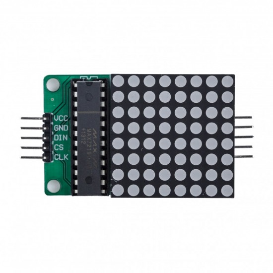

# MAX7219_library
Library for control of 8x8 LED matrix driven by MAX7219 display driver. This library was written with the intention to be used for a microcontroller based gaming console.

## Features
- Easy driver configuration with dedicated functions, normal operation can be initialized with a single function.
- Software implemented SPI protocol allows to unconstrained selection of CS, CLK and DATA pins.
- Each LED is controlled individually.
- Does not support cascaded displays.

## Functions
- void init();
- void clear();
- void configCtrlReg(uint8_t reg_address, uint8_t data);
- void configIntensity(uint8_t intensity);
- void switchLED(uint8_t column, uint8_t row, uint8_t data);
